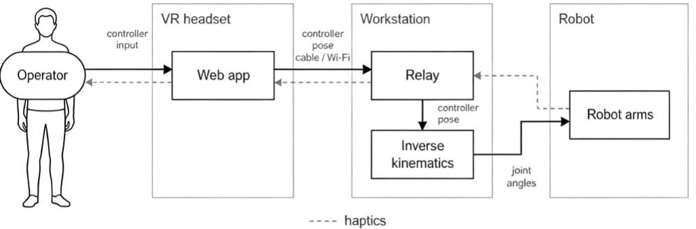
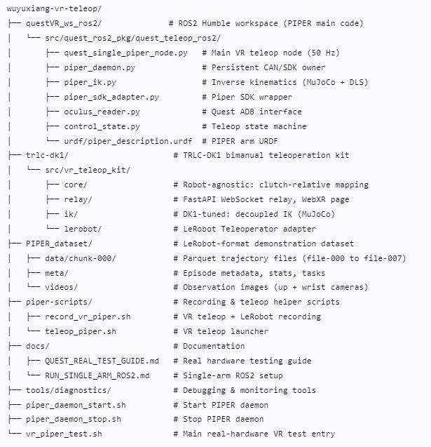

# yuxiang-vr-teleop

VR teleoperation kit for the **PIPER robotic arm** using a **Meta Quest** headset. A ROS2 Humble node reads 7-DoF controller poses from the Quest via USB ADB, runs inverse kinematics (IK) on a MuJoCo model built from the PIPER URDF, and sends joint commands over CAN bus through the Piper SDK.

> **Paper**: [*Beyond Kinesthetic Twins: A Dematerialized Control Primitive for Zero-Shot Generalization Across Robot Morphologies*](https://doi.org/10.21203/rs.3.rs-10484850/v1)  
> DOI: [10.21203/rs.3.rs-10484850/v1](https://doi.org/10.21203/rs.3.rs-10484850/v1)
**Authors:** [Yuxiang Wu](https://github.com/molyswu)¹\*,Tusun Wu²* , Yuyan Wu3  
¹ The Education University of Hong Kong  
2 Shenzhen Metachip Technology Co,. Ltd    
3 Guangdong Polytechnic Normal University  
\* 
This project implements the dematerialized control primitive (DCP) described in the paper — a clutch-relative VR pose mapping that decouples teleoperation from any specific robot morphology, enabling zero-shot transfer of learned manipulation policies from simulation to real-world robots of different kinematic structures.

**Supported robots and SDKs:**

| Platform | SDK / URDF |
|----------|------------|
| PIPER (single-arm) | [agilexrobotics/piper_sdk](https://github.com/agilexrobotics/piper_sdk), [mujoco_menagerie/agilex_piper](https://github.com/google-deepmind/mujoco_menagerie/tree/main/agilex_piper) |
| TRLC-DK1 (bimanual) | [robot-learning-co/trlc-dk1](https://github.com/robot-learning-co/trlc-dk1) |

## Demo Videos

| PIPER (single-arm) | TRLC-DK1 (bimanual) |
|:---:|:---:|
| [](video/vr-teleop-PIPER.mp4) | [](video/vr-teleop-trlc-dk1-1.mp4) |
| *Clutch-relative mapping + safety gate* | [](video/vr-teleop-trlc-dk1-2.mp4) |
| | [](video/vr-teleop-trlc-dk1-3.mp4) |
| | [](video/vr-teleop-trlc-dk1-4.mp4) |

Click any video to view (opens in browser's native video player).

## Highlights

| Feature | Description |
|---------|-------------|
| **Clutch-relative mapping** | Hold the grip button and the robot follows your hand's relative motion; release, reposition, grab again. |
| **Safety gate** | B-button acts as a hardware-level enable — the arm only moves while held. |
| **A+B home** | Hold A+B simultaneously and the arm returns to its home pose at a controlled speed. |
| **Workspace limits** | Translation and rotation are clipped to configured bounds. Pushing past a joint limit or boundary feels like a wall. |
| **Adaptive smoothing** | Pose smoothing responds to VR tracking quality — shaky tracking gets stronger filtering; clean tracking stays crisp. |
| **Anchor stabilization** | When the arm is small in the controller view, the IK target is anchored to reduce jitter (configurable threshold). |
| **Deadband & jump rejection** | Tiny controller motions are ignored (deadband); sudden pose jumps trigger rejection (teleport protection). |
| **Tracking freshness** | If VR tracking data goes stale (default 0.5 s), the robot stops immediately. |
| **USB connectivity** | ADB reverse over USB cable, ~1 ms latency, reliable and low-jitter. |
| **CAN bus monitoring** | The startup script checks can0 is ERROR-ACTIVE before enabling the arm. |

## System Architecture



**Data flow:** Operator controller input → WebXR app on the Quest → workstation relay → decoupled IK → robot arm joint commands. Haptic feedback flows back from the arm/workstation to the headset.

### Repository Structure



## Architecture

```
questVR_ws_ros2/src/quest_ros2_pkg/quest_teleop_ros2/
├── quest_single_piper_node.py   # Main VR-to-arm teleop node (50 Hz)
├── piper_daemon.py              # Persistent CAN/SDK owner, subscribes to /joint_command
├── piper_ik.py                  # Inverse kinematics (MuJoCo model + damped least squares)
├── piper_sdk_adapter.py         # Piper SDK wrapper (CAN connect, enable, joint I/O)
├── oculus_reader.py             # Quest ADB interface (reads controller transforms from logcat)
├── oculus_pose_node.py          # Diagnostic node (publishes VR poses as ROS2 PoseStamped/TF)
├── pose_math.py                 # Pose utilities (transform ops, smoothing, interpolation)
├── control_state.py             # Teleop state machine (idle → engaged → anchor → running)
├── buttons_parser.py            # Quest controller button state decoding
├── safe_home_config.py          # Home pose configuration
├── FPS_counter.py               # Frame-rate monitor
└── urdf/
    └── piper_description.urdf   # PIPER arm URDF for MuJoCo IK model
```

Three layers, separated by concern:

1. **VR Input** (`oculus_reader.py`): Reads controller poses and button states from the Quest via USB ADB. Installs a debug APK on the headset, parses logcat output into 4×4 homogeneous transform matrices.

2. **Teleop Core** (`quest_single_piper_node.py`): State machine that manages clutch engagement (grip button), safety gate (B button), home command (A+B), anchor stabilization, workspace clipping, adaptive smoothing, deadband filtering, and jump rejection. Runs at 50 Hz.

3. **Arm I/O** (`piper_daemon.py` + `piper_sdk_adapter.py`): Persistent daemon that owns the CAN bus connection and motor enable state. Subscribes to `/joint_command`, publishes `/piper_measured_joint_state`. The daemon stays alive across VR client restarts — stop it explicitly with `piper_daemon_stop.sh`.

## Supplementary Materials

Quantitative details from the paper's Supplementary Materials.

### Experimental Setups

| Platform | Hardware | Software Stack | Task Protocol | Evaluation Metrics |
|----------|----------|----------------|---------------|--------------------|
| **PIPER** | PIPER 7-DOF collaborative arm, Meta Quest 3, USB-ADB, CAN bus (`can0`, 1 Mbps) | ROS2 Humble, Python 3.10 (Conda `vt`), MuJoCo for IK | Elevator button pressing via VR controller | Success rate, completion time, end-effector positioning error, NASA-TLX workload score |
| **TRLC-DK1** | TRLC-DK1 bimanual arms, Meta Quest 3, wrist + Intel RealSense D435/D405 cameras | WebXR relay (FastAPI WebSocket), decoupled IK with MuJoCo, LeRobot teleoperator | Dual-arm pick-and-place; one arm fixes, the other manipulates | Grasp/place success, transport stability, alignment error, completion time, NASA-TLX workload score |

### Supplementary Results

**PIPER (single-arm)**
- Zero-shot deployment: no code changes or retraining.
- Wrist-rotation drift: **2.1 ± 0.4 mm** (below physiological tremor).
- Task performance: **100 %** success rate, **13.5 ± 1.4 s** mean task time, **33.1 ± 5.8** NASA-TLX.
- Human-in-the-loop takeover latency: **96.7 ± 12.0 ms**.

**TRLC-DK1 (bimanual)**
- Wrist-rotation drift: **1.1 ± 0.3 mm** (decoupled IK + wrist-pivot calibration).
- Pick-and-place: **100 %** success rate, **12.3 ± 1.1 s** mean task time, **31.5 ± 5.2** NASA-TLX.
- Singularity jerk suppression: **3.2 ± 0.9 deg/step** (4.6× improvement with adaptive damping).
- Takeover latency: **89.4 ± 12.0 ms**.

### Table S1. PIPER Elevator-Button Pressing Performance

Mean ± SD across 10 operators and 20 repetitions per button position.

| Button Position | Success Rate (%) | Mean Task Time (s) | Mean Positioning Error (mm) |
|-----------------|------------------|--------------------|-----------------------------|
| Top-Left        | 100              | 14.2 ± 1.5         | 2.4 ± 0.5                   |
| Top-Right       | 100              | 13.8 ± 1.3         | 2.1 ± 0.4                   |
| Center          | 100              | 12.9 ± 1.0         | 1.5 ± 0.3                   |
| Bottom-Left     | 100              | 14.5 ± 1.6         | 2.6 ± 0.6                   |
| Bottom-Right    | 100              | 13.5 ± 1.2         | 2.0 ± 0.4                   |
| **Overall Average** | **100**      | **13.8 ± 1.3**     | **2.1 ± 0.4**               |

### Table S2. TRLC-DK1 Bimanual Pick-and-Place by Object Size and Weight

Mean ± SD across 10 operators and 10 repetitions per object category.

| Object Category | Size (cm³) | Weight (kg) | Grasp Success (%) | Place Success (%) | Overall Success (%) | Mean Cycle Time (s) |
|-----------------|------------|-------------|-------------------|-------------------|---------------------|---------------------|
| Small-Light     | 5 × 5 × 5  | 0.1         | 100               | 100               | 100                 | 11.8 ± 0.9          |
| Small-Heavy     | 5 × 5 × 5  | 0.5         | 100               | 100               | 100                 | 12.5 ± 1.0          |
| Medium-Light    | 10 × 10 × 10 | 1.0       | 100               | 100               | 100                 | 13.2 ± 1.2          |
| Medium-Heavy    | 10 × 10 × 10 | 3.0       | 100               | 100               | 100                 | 14.8 ± 1.5          |
| Large-Light     | 15 × 15 × 15 | 2.0       | 100               | 100               | 100                 | 16.1 ± 1.8          |
| Large-Heavy     | 15 × 15 × 15 | 5.0       | 100               | 100               | 100                 | 17.5 ± 2.0          |

### Table S3. TRLC-DK1 Bimanual Cooperative-Manipulation Tasks

Mean ± SD across 10 operators and 15 trials per task type. Cooperative alignment error is the relative positional deviation between the two end-effectors at task closure.

| Cooperative Task Type | Success Rate (%) | Task Completion Time (s) | Cooperative Alignment Error (mm) | NASA-TLX Workload Score |
|-----------------------|------------------|--------------------------|----------------------------------|-------------------------|
| Precision Peg-in-Hole Insertion | 100 | 14.2 ± 2.1 | 0.4 ± 0.1 | 32.1 ± 5.4 |
| Screw Tightening (Threaded Assembly) | 100 | 20.5 ± 3.2 | 1.2 ± 0.3 | 35.4 ± 6.1 |
| Long-Bar Cooperative Transport | 100 | 17.8 ± 2.5 | 2.5 ± 0.6 | 34.2 ± 5.7 |
| Dual-Arm Sequential Assembly (Fix + Operate) | 100 | 24.1 ± 3.8 | 1.8 ± 0.5 | 38.5 ± 6.8 |

## Prerequisites

- **OS**: Ubuntu 22.04 (ROS2 Humble)
- **Python**: 3.10 with Conda environment `vt`
- **Robot**: PIPER arm connected via CAN bus (`can0`, 1 Mbps)
- **VR**: Meta Quest 2/3 with USB cable and Developer Mode enabled
- **Piper SDK**: Python bindings for CAN control

## Install

```bash
# Clone this repo
git clone git@github.com:molyswu/wuyuxiang-vr-teleop.git
cd wuyuxiang-vr-teleop

# Set up ROS2 Humble environment
source /opt/ros/humble/setup.bash

# Build the ROS2 workspace
cd questVR_ws_ros2
colcon build
source install/setup.bash

# Set up the Conda environment (vt) with Piper SDK
conda activate vt
```

Optional: install LeRobot for data recording:

```bash
pip install lerobot
```

## Quick Start

### 1. Connect the Quest (USB)

One-time setup: enable Developer Mode (Meta Quest mobile app → Devices → your headset → Developer Mode), plug in the USB cable, accept the "Allow USB debugging" prompt in the headset.

```bash
adb devices          # verify Quest is connected
adb reverse tcp:8081 tcp:8081   # forward Oculus Debug Bridge port
```

### 2. Start the Piper Daemon

```bash
cd ~/yuxiang-vr-teleop
bash piper_daemon_start.sh
```

This script validates `can0` is ERROR-ACTIVE, resets CAN if needed, and launches `piper_daemon` in the background. PID is stored at `/tmp/quest_piper_daemon.pid`. The daemon enables the arm motor and publishes joint states at 30 Hz.

### 3. Start VR Teleoperation

```bash
cd ~/yuxiang-vr-teleop
bash vr_piper_test.sh
```

This script:
1. Checks `can0` exists and the Quest is connected via ADB
2. Prompts for safety confirmation
3. Starts `piper_daemon` (if not already running)
4. Launches `quest_single_piper_node` with carefully tuned ROS2 parameters

### 4. Operate the Arm

| Button | Action |
|--------|--------|
| **Grip** | Clutch — hold to engage; release to freeze |
| **B** | Safety gate — arm moves only while held |
| **A + B** (hold) | Return to home pose |
| **X / Y** | (unused by default) |

### 5. Stop

```bash
# Stop the VR client: Ctrl+C in the terminal running vr_piper_test.sh

# Stop the daemon (disables motor + disconnects CAN):
bash piper_daemon_stop.sh
```

## Key ROS2 Parameters

All tunable via `--ros-args -p` when launching `quest_single_piper_node`:

| Parameter | Default | Description |
|-----------|---------|-------------|
| `translation_scale` | 1.0 | Scaling factor from VR translation to robot workspace |
| `rotation_scale` | 0.15 | Scaling factor for rotational motion |
| `pos_smooth` | 0.85 | Exponential smoothing for position (0=instant, 1=full smoothing) |
| `rot_smooth` | 0.85 | Exponential smoothing for rotation |
| `deadband` | 0.003 | Translation deadband threshold (m) |
| `rot_deadband` | 0.01 | Rotation deadband threshold (rad) |
| `workspace_x/y/z_min/max` | ±0.15, ±0.12, ±0.12 | Workspace boundary clipping (m) |
| `anchor_ratio` | 0.15 | When controller motion < this ratio of workspace, anchor the target |
| `stale_timeout` | 0.5 | Max age of VR data before safety stop (s) |
| `jump_threshold` | 0.15 | Pose change threshold for jump rejection (m) |
| `allow_hardware` | `true` | Set `false` for dry-run without physical arm |

Override on the command line:

```bash
ros2 run quest_teleop_ros2 quest_single_piper_node \
    --ros-args -p translation_scale:=0.8 -p rotation_scale:=0.1
```

## Data Recording with LeRobot

Record VR-teleoperated demonstration episodes for imitation learning:

```bash
cd ~/yuxiang-vr-teleop
bash piper-scripts/record_vr_piper.sh
```

This script:
1. Starts the PIPER daemon and VR teleop node
2. Launches a LeRobot recording session (`lerobot-record`)
3. Captures camera streams, joint states, and actions into the LeRobot dataset format

See `docs/superpowers/` for the full recording pipeline design document.

## Diagnostic Tools

```bash
# Monitor raw Quest poses (no IK, no arm)
ros2 run quest_teleop_ros2 oculus_pose_node

# Diagnose coordinate mapping issues
python tools/diagnostics/diagnose_quest_mapping.py

# Monitor raw Quest controller data directly
python tools/diagnostics/raw_quest_pose_monitor.py
```

## Environment Setup Script

```bash
# One-step environment setup (sources ROS2 + workspace)
source quest_ros2_env.sh
```

This activates the `vt` Conda environment, sources ROS2 Humble and the `questVR_ws_ros2` install workspace.

## Directory Map

```
yuxiang-vr-teleop/
├── questVR_ws_ros2/          # ROS2 Humble workspace (main code)
│   └── src/quest_ros2_pkg/quest_teleop_ros2/
│       ├── quest_single_piper_node.py    # Main VR teleop node
│       ├── piper_daemon.py               # Persistent arm driver
│       ├── piper_ik.py                   # IK solver
│       ├── piper_sdk_adapter.py          # Piper SDK wrapper
│       ├── oculus_reader.py              # Quest ADB interface
│       └── urdf/piper_description.urdf   # PIPER URDF
├── piper-scripts/            # Recording & teleop helper scripts
│   ├── record_vr_piper.sh               # VR teleop + LeRobot recording
│   ├── record_piper.sh                   # Direct Piper recording
│   ├── teleop_piper.sh                   # VR teleop launcher
│   └── vr_record_piper.py               # Python recording orchestrator
├── docs/                     # Documentation
│   ├── QUEST_REAL_TEST_GUIDE.md          # How to test with real hardware
│   ├── RUN_SINGLE_ARM_ROS2.md            # Single-arm ROS2 setup
│   └── superpowers/                      # Design docs & plans
├── tools/
│   ├── diagnostics/                      # Debugging & monitoring
│   │   ├── diagnose_quest_mapping.py
│   │   └── raw_quest_pose_monitor.py
│   └── apk_build/                        # Quest APK build sources
├── scripts/
│   ├── admin/                            # Install & repair scripts
│   │   ├── install_ros2_humble_safe.sh
│   │   └── repair_ros2_dpkg_safe.sh
│   └── legacy/                           # Older test scripts
├── backups/                   # Rollback copies & generated files
├── lerobot/                   # LeRobot installed package (pip install)
├── vt_lerobot_backup/         # Pre-install pip freeze snapshot
├── piper_daemon_start.sh      # Start PIPER daemon
├── piper_daemon_stop.sh       # Stop PIPER daemon (disables arm)
├── vr_piper_test.sh           # Main real-hardware VR test entry point
├── run_quest_single_piper.sh  # Thin wrapper for quest_single_piper_node
├── quest_ros2_env.sh          # ROS2 environment setup
└── QUEST_SESSION_HANDOFF.md   # Handoff notes for VR teleop sessions
```

## Network & Hardware

| Component | Details |
|-----------|---------|
| **Host machine** | Linux workstation (`mc509@192.168.50.167`) |
| **CAN interface** | `can0` at 1 Mbps (SocketCAN) |
| **VR connection** | USB cable with ADB reverse forwarding |
| **ROS2 DDS** | CycloneDDS (default in Humble) |

## Adapting to a Different Arm

The VR input layer (`oculus_reader.py`) and the ROS2 node framework carry over to any arm unchanged. To adapt for a different robot:

1. **URDF**: Replace `urdf/piper_description.urdf` with your arm's URDF.
2. **IK** (`piper_ik.py`): The IK solver uses MuJoCo for forward kinematics + Jacobian. Update the site names, joint ordering, and workspace limits for your arm.
3. **SDK Adapter** (`piper_sdk_adapter.py`): Replace with your arm's driver. The contract is: `connect()`, `enable()`, `disable()`, `get_joint_positions()`, `send_joint_command()`.
4. **Home Pose** (`safe_home_config.py`): Set `JOINT_HOME` to your arm's safe parked position.

The safety features (workspace clipping, deadband, smoothing, jump rejection) are arm-agnostic and configurable via ROS2 parameters.

## Troubleshooting

**CAN bus not found:**
```bash
sudo ip link set can0 type can bitrate 1000000
sudo ip link set up can0
# Verify: ip -details link show can0  (should say ERROR-ACTIVE)
```

**Quest not detected:**
```bash
adb kill-server && adb start-server
adb devices   # should list your Quest
```

**Arm doesn't move:**
- Verify `piper_daemon` is running: `cat /tmp/quest_piper_daemon.pid`
- Check B-button is held (safety gate)
- Check grip button is held (clutch engage)
- Check `allow_hardware:=true` is set

**Dry-run without physical arm:**
```bash
ros2 run quest_teleop_ros2 quest_single_piper_node \
    --ros-args -p allow_hardware:=false
```

## License

Apache-2.0
